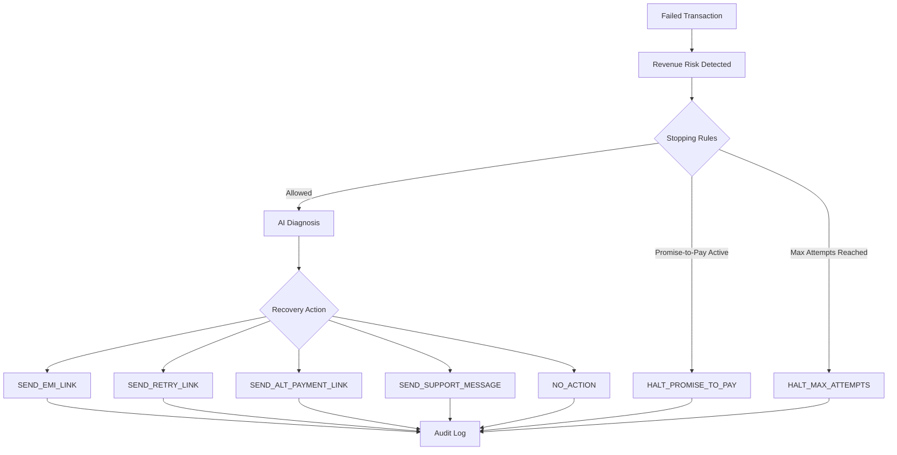

# ⚡ AI Revenue Recovery Agent

> **AI-powered revenue recovery with bounded automation, intelligent diagnosis, strict stopping rules, and complete auditability.**

<p align="center">
  <strong>Detect → Diagnose → Recover → Audit</strong>
</p>

<p align="center">
  A production-inspired Proof of Concept for intelligently recovering at-risk revenue from failed payments and abandoned checkouts.
</p>

---

## ◈ Overview

**AI Revenue Recovery Agent** detects at-risk revenue such as failed payments and abandoned checkouts, diagnoses the underlying cause using an **LLM**, and executes a controlled recovery workflow.

Unlike unrestricted AI automation, every intervention is **bounded by predefined actions and strict stopping rules**.

Every AI decision, executed action, and halted intervention is recorded in a complete **audit trail**.

### Core Principles

| | Principle | Description |
|---|---|---|
| ◉ | **Detect** | Identify failed payments and revenue at risk |
| ✦ | **Diagnose** | Use an LLM to understand the root cause |
| ↗ | **Recover** | Select an action from a controlled recovery set |
| ◇ | **Guard** | Stop interventions when safety rules trigger |
| ≡ | **Audit** | Record every decision and outcome |

---

## ✦ Key Features

- **AI-powered diagnosis** of failed transactions
- **Automated revenue recovery** workflows
- **Bounded AI actions** from a predefined closed set
- **Promise-to-pay protection**
- **Maximum intervention limits**
- **Complete AI audit trail**
- **Failed payment webhook processing**
- **Recovery analytics dashboard**
- **Supabase persistence**
- **OpenRouter LLM integration**
- **FastAPI backend**
- **Light & Dark mode dashboard**

---

## ◈ System Architecture

```text
┌───────────────────────────────┐
│      PAYMENT / CHECKOUT       │
└───────────────┬───────────────┘
                │
                ▼
┌───────────────────────────────┐
│        RISK DETECTION         │
│   Failed Payment / Checkout   │
└───────────────┬───────────────┘
                │
                ▼
┌───────────────────────────────┐
│        STOPPING RULES         │
│                               │
│  • Promise-to-Pay Protection │
│  • Maximum Attempt Limit     │
└───────────────┬───────────────┘
                │
                ▼
┌───────────────────────────────┐
│          AI DIAGNOSIS         │
│       OpenRouter + LLM        │
└───────────────┬───────────────┘
                │
                ▼
┌───────────────────────────────┐
│       RECOVERY ACTION         │
│   Controlled Action Selection │
└───────────────┬───────────────┘
                │
                ▼
┌───────────────────────────────┐
│          AUDIT TRAIL          │
│           Supabase            │
└───────────────────────────────┘
```

> **Important:** Stopping rules are evaluated **before the AI is called**, ensuring every recovery workflow remains bounded.

---

## 🛡 Bounded AI — Stopping Rules

The agent cannot continuously contact a customer.

Before invoking the AI, the backend checks two important guardrails.

### 01 — Active Promise-to-Pay

If the customer already has an active promise-to-pay:

```text
HALT_PROMISE_TO_PAY
```

**Result:** The workflow stops immediately and no recovery message is sent.

---

### 02 — Maximum Intervention Attempts

The default intervention limit is:

```env
MAX_INTERVENTION_ATTEMPTS=2
```

When the limit has already been reached:

```text
HALT_MAX_ATTEMPTS
```

**Result:** No additional AI recovery intervention is allowed.

### Example

```text
Attempt 01  →  AI Recovery Action
Attempt 02  →  AI Recovery Action
Attempt 03  →  HALT_MAX_ATTEMPTS
```

---

## ✦ Controlled Recovery Actions

The LLM cannot generate arbitrary executable actions.

It must select **one action from this closed set:**

```text
SEND_EMI_LINK
SEND_RETRY_LINK
SEND_ALT_PAYMENT_LINK
SEND_SUPPORT_MESSAGE
NO_ACTION
```

This creates a clear boundary between **AI reasoning** and **system execution**.

---

## ◎ Recovery Workflow



---

## ◈ Project Structure

```text
ai-revenue-recovery/
│
├── backend/
│   ├── main.py
│   │   └── FastAPI application + webhook endpoint
│   │
│   ├── ai_agent.py
│   │   └── OpenRouter LLM logic + prompts
│   │
│   └── database.py
│       └── Supabase client + database access
│
├── frontend/
│   └── app.py
│       └── Revenue recovery dashboard
│
├── supabase_schema.sql
├── requirements.txt
├── .env.example
└── README.md
```

---

## ⚙ Tech Stack

| Layer | Technology |
|---|---|
| **Backend** | Python · FastAPI |
| **AI / LLM** | OpenRouter |
| **Database** | Supabase |
| **Frontend** | Streamlit |
| **API** | REST / Webhooks |
| **Database Language** | SQL |

---

# Getting Started

## 01 — Clone Repository

```bash
git clone https://github.com/siddharthdeshmukh25/Revenue-AI.git
cd Revenue-AI
```

---

## 02 — Create Virtual Environment

```bash
python -m venv venv
```

### Windows

```bash
venv\Scripts\activate
```

### macOS / Linux

```bash
source venv/bin/activate
```

---

## 03 — Install Dependencies

```bash
pip install -r requirements.txt
```

---

## 04 — Configure Environment

Create your `.env` file from `.env.example`.

### Windows

```bash
copy .env.example .env
```

### macOS / Linux

```bash
cp .env.example .env
```

Configure:

```env
SUPABASE_URL=your_supabase_url
SUPABASE_KEY=your_supabase_key

OPENROUTER_API_KEY=your_openrouter_api_key
OPENROUTER_MODEL=meta-llama/llama-3.1-8b-instruct

MAX_INTERVENTION_ATTEMPTS=2
```

> [!CAUTION]
> Never commit `.env`, Supabase service-role keys, OpenRouter API keys, or other secrets to GitHub.

---

## 05 — Create Database

Open your **Supabase Dashboard** and navigate to:

```text
SQL Editor → New Query
```

Paste and execute:

```text
supabase_schema.sql
```

This creates the core tables:

```text
users
transactions
ai_audit_logs
```

along with seed users for testing.

---

## 06 — Start Backend

```bash
cd backend
python main.py
```

Alternatively:

```bash
uvicorn main:app --reload --port 8000
```

### API Documentation

```text
http://localhost:8000/docs
```

---

## 07 — Start Dashboard

Open another terminal with the virtual environment activated.

```bash
cd frontend
streamlit run app.py
```

---

# 🧪 Test Recovery Agent

Send a simulated failed transaction:

```bash
curl -X POST http://localhost:8000/webhook/transaction \
  -H "Content-Type: application/json" \
  -d '{
    "user_name": "Aarav Sharma",
    "user_email": "aarav.sharma@example.com",
    "user_phone": "+919810012345",
    "amount": 2499.00,
    "status": "failed",
    "error_code": "INSUFFICIENT_FUNDS"
  }'
```

The system will:

```text
01  Receive failed transaction
        ↓
02  Check stopping rules
        ↓
03  Diagnose failure using AI
        ↓
04  Select bounded recovery action
        ↓
05  Execute / simulate intervention
        ↓
06  Record complete audit trail
```

---

# ◎ Example AI Decision

```json
{
  "customer": "Aarav Sharma",
  "amount": 2499,
  "status": "failed",
  "diagnosis": "INSUFFICIENT_FUNDS",
  "action": "SEND_ALT_PAYMENT_LINK",
  "result": "EXECUTED"
}
```

After the maximum allowed interventions:

```json
{
  "customer": "Aarav Sharma",
  "action": "NO_ACTION",
  "result": "HALTED",
  "stopping_rule": "HALT_MAX_ATTEMPTS"
}
```

---

# ≡ Complete Audit Trail

Every outcome is recorded in:

```text
ai_audit_logs
```

The audit trail captures both **executed and halted decisions**, making AI behavior traceable.

```text
┌──────────────────────────────────────┐
│ AI RECOVERY EVENT                    │
├──────────────────────────────────────┤
│ Customer      Aarav Sharma           │
│ Amount        ₹2,499                 │
│ Diagnosis     Insufficient Funds     │
│ Action        ALT PAYMENT LINK       │
│ Result        EXECUTED               │
│ Attempts      1 / 2                  │
└──────────────────────────────────────┘
```

---

# ◈ Dashboard Experience

The dashboard follows a modern AI/fintech SaaS design system.

### Visual Direction

**Light mode is the default**, with full dark-mode support.

The interface uses:

- Modern structured dashboard architecture
- Clean sidebar navigation
- Spacious but balanced content layout
- Thin **1px subtle outlines**
- Rounded rectangular containers
- Minimal borders and shadows
- Compact information cards
- Modern sans-serif typography
- Clear visual hierarchy
- High-contrast surfaces
- Subtle **neon-lime accents**
- Responsive desktop and mobile layouts

### Design Philosophy

```text
Minimal
   ×
Professional
   ×
Futuristic
   ×
Fintech
   ×
AI
```

The neon-lime accent is intentionally reserved for **primary actions, active states, recovery indicators, and AI-related elements** rather than being used throughout the entire interface.

---

# 🔮 Beyond the PoC

The architecture can be extended with:

- Real SMS / WhatsApp recovery messages
- Twilio or MSG91 integration
- Email recovery workflows
- Automated promise-to-pay expiration
- Customer segmentation
- Recovery probability prediction
- A/B testing of recovery strategies
- Advanced recovery analytics
- Authentication and RBAC
- Supabase Row Level Security
- AI evaluation and monitoring
- Production observability

---

# ⚠ Production Considerations

This repository is currently a **Proof of Concept**.

Before using it in production:

```text
✓ Enable authentication & authorization
✓ Configure Supabase Row Level Security
✓ Protect service-role credentials
✓ Add API rate limiting
✓ Validate AI outputs before execution
✓ Add production logging & monitoring
✓ Secure customer communication channels
```

> [!IMPORTANT]
> The Supabase service-role key must remain server-side. Never expose privileged credentials directly to a production frontend.

---

# ◈ Project Philosophy

> ### Recover revenue intelligently — without giving AI unlimited control.

The system combines **LLM reasoning** with deterministic guardrails so every intervention remains:

**Bounded · Explainable · Traceable · Auditable**

---

## 👨‍💻 Author

**Siddharth Deshmukh**

AI Revenue Recovery Agent · Proof of Concept

---

<p align="center">
  <strong>AI Revenue Recovery Agent</strong>
  <br>
  <sub>Intelligent recovery. Controlled execution. Complete auditability.</sub>
</p>